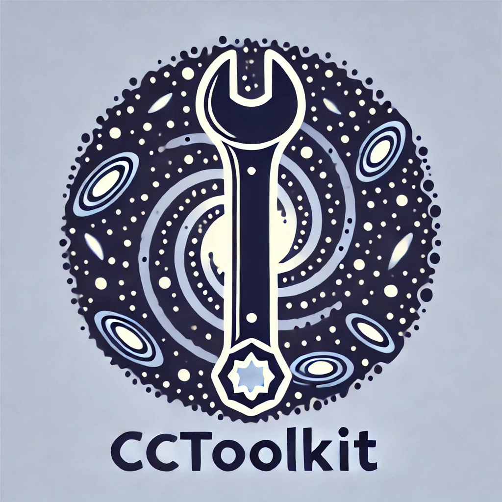

# CCToolkit



[](https://github.com/TiagoBsCastro/CCToolkit/actions)
[](https://doi.org/10.5281/zenodo.13479345)
[](https://cctoolkit.readthedocs.io/en/latest/?badge=latest)
[](https://opensource.org/licenses/MIT)
[](https://github.com/TiagoBsCastro/CCToolkit/commits/main)

<div align="justify">

CCToolkit is a Python package designed for Cluster Cosmology calculations. It handles cosmological parameters, power spectrum computations, halo mass functions, and halo bias and integrates with the CAMB library to deliver precise cosmological data processing.

## Table of Contents
- [Features](#features)
- [Installation](#installation)
- [Usage](#usage)
- [Examples](#examples)
- [Documentation](#documentation)
- [Contributing](#contributing)
- [License](#license)
- [Acknowledgements](#acknowledgements)

## Features

- **Cosmological Calculations**: Easily compute various cosmological quantities, including background quantities and power spectra.
- **Halo Mass Function (HMF)**: Implements the multiplicity function and HMF parameters for different halo finders based on the model presented in [Castro et al. 2023](https://inspirehep.net/literature/2132031).
- **Halo Bias**: Implements the functions to compute the linear halo bias, with corrections based on the Peak Background Split (PBS) model presented in [Castro et al. 2024b](https://inspirehep.net/literature/2824892).
- **Baryonic impact**: Implements the model presented in [Castro et al. 2024a](https://inspirehep.net/literature/2718844) for the baryonic impact on cluster and group masses.
- **Utility Functions**: Provides useful utilities for manipulating the power spectrum.

## Installation

To install CCToolkit clone the repository and use pip:

```bash
git clone https://github.com/TiagoBsCastro/CCToolkit.git
cd CCToolkit
python -m pip install .
```

### Dependencies

- Python 3.9+
- NumPy
- SciPy
- CAMB

## Usage

To use CCToolkit, start by importing the necessary modules and initializing the `CosmologyCalculator` with your desired cosmological parameters:

```python
from cctoolkit import CosmologyCalculator

# Define cosmological parameters
params = {
    'H0': 70.0,                # Hubble parameter at z=0 in km/s/Mpc
    'Ob0': 0.05,               # Baryon density parameter
    'Om0': 0.3,                # Total matter density parameter (Ob0 + Om_c0)
    'sigma8': 0.8,             # rms density fluctuation amplitude at 8 h^-1 Mpc
    'ns': 0.96,                # Scalar spectral index
    'TCMB': 2.7255,            # CMB Temperature at z=0 in K
    'mnu': 0.06,               # Sum of neutrino masses (eV)
    'num_massive_neutrinos': 1 # Number of massive neutrinos species
}

# Initialize the calculator
cosmo_calc = CosmologyCalculator(params)
```

## Examples

### Halo Mass Function

Calculate the halo mass function for a range of masses following [Castro et al. 2023](https://inspirehep.net/literature/2132031):

```python
import numpy as np
import matplotlib.pyplot as plt

masses = np.logspace(13, 15.5, num=100)
hmf = cosmo_calc.dndlnM(masses, 0)
plt.loglog(masses, hmf)
plt.xlabel(r"$M_{\rm vir}\,[M_\odot h^{-1}]$")
plt.ylabel(r"$\frac{{\rm d} n}{{\rm d} \log M}\,[{\rm Mpc}^{-3} h^{3}]$")
plt.show()
```

### Halo Bias

CCToolkit can compute both the PBS prescription as well as the corrected model following Castro et al. in prep.

```python
pbs = cosmo_calc.pbs_bias(masses, 0)
bias = cosmo_calc.bias(masses, 0)

plt.loglog(masses, pbs, label=r'${\rm PBS}$')
plt.loglog(masses, bias, label=r'${\rm Castro\, et\,al.\,2024}$')
plt.xlabel(r"$M_{\rm vir}\,[M_\odot h^{-1}]$")
plt.ylabel(r"$b(M)$")
plt.legend()
plt.show()
```

### Baryonic Impact

CCToolkit can compute the equivalent dark-matter-only halo mass of a hydrodynamical simulated group or cluster in two simple steps:

```python
import cctoolkit
from cctoolkit import baryons
from cctoolkit.cosmology import CosmologyCalculator
z = 0.0
# Magneticum cosmology
params = {"Om0": 0.272, "Ob0": 0.272 * 0.168, "H0": 70.4, "ns": 0.963, "mnu":0, "num_massive_neutrinos": 0, "sigma8": 0.809}
cosmo_calc = CosmologyCalculator()
# Array of virial masses on hydro
M = np.geomspace(1e13, 3e14)
# Calculating the equivalent DMO mass at the threshold of equivalence according to the quasi-adiabatic model
M_Delta_dmo, Delta = baryons.compute_dmo_mass(M, z, 0.168)
Delta *= cctoolkit.utils.virial_Delta(cosmo_calc.Omega_m(z))
# Converting to the virial mass
mdmo = [baryons.compute_rec_mass(cosmo_calc, m, d, z) for m, d in zip(M_Delta_dmo, Delta)]
```

## Documentation

Please visit [CCToolkit Documentation](https://cctoolkit.readthedocs.io) for detailed documentation and API reference.

## Contributing

Contributions are welcome! Please see our [Contributing Guidelines](CONTRIBUTING.md) for details on how to contribute to this project. You can report issues, suggest features, or submit pull requests.

## License

This project is licensed under the MIT License. See the [LICENSE](LICENSE) file for more information.

## Acknowledgements

This package relies on the CAMB library for cosmological calculations. We also acknowledge the authors of the various halo finder software used to produce the best-fit parameters implemented in this package.

</div>
